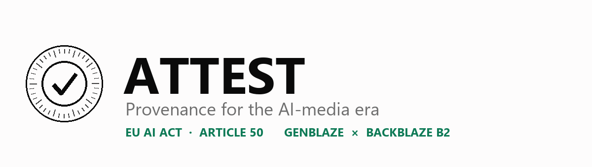
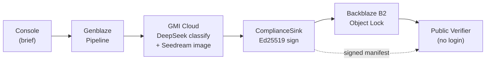

# ATTEST

[](https://github.com/Demiladepy/attest/actions/workflows/ci.yml)
&nbsp;·&nbsp; **Live:** [attest-black-two.vercel.app](https://attest-black-two.vercel.app)

**A compliance-grade AI media gateway for the EU AI Act era.**

Every AI-generated asset that leaves your pipeline ships with a cryptographically signed provenance manifest, stored under Backblaze B2 Object Lock. Anyone can verify authenticity in seconds. Any tampering — even one pixel — is caught immediately.

Built for the [Backblaze Generative AI Media Hackathon](https://backblaze-generative-media.devpost.com/).

---

## Why this exists

On **August 2, 2026**, Article 50 of the EU AI Act comes into force. Every provider and deployer of generative AI must ensure AI-generated content is marked in a machine-readable format and detectable as artificially generated. Failure to comply is punishable by fines up to **€15 million or 3% of global annual turnover**.

Existing tools solve pieces — Adobe Content Credentials for creative teams, Truepic for citizen journalism. Nothing wraps the entire multi-provider generation pipeline with signing, provenance, durable storage, and public verification in one gateway. **ATTEST is a reference implementation of that gateway, built on Backblaze Genblaze and B2.**

---

## Live URLs

| Surface | URL |
|---|---|
| 🌐 Live app (landing + public verifier) | **https://attest-black-two.vercel.app** |
| ✅ Verify a signed asset (one click) | [attest-black-two.vercel.app/verify](https://attest-black-two.vercel.app/verify) |
| 🎬 Demo video (3 min) | `[PASTE YOUTUBE URL]` |
| 🔗 Genblaze upstream PR (Mode 2 Ed25519 signer) | `[PASTE PR URL]` |
| 💻 Source | https://github.com/Demiladepy/attest |

> The **Console** (generate → sign) runs locally by design — the Ed25519 **private signing key never touches a public host**, which is the correct security posture for a signing service. The public **verifier** is fully live and needs no login.

---

## The demo in one picture

A real AI-generated asset (Seedream on GMI Cloud), signed and verifiable:


Change **one pixel** — invisible to the eye — and the seal breaks instantly:

| | SHA-256 of the bytes | Verdict |
|---|---|---|
| **Signed asset** | `ff75b9ec23a64b59…` (matches the signed manifest) | ✅ **Verified** |
| **After a 1-pixel edit** | `1fbbf005f5a1718e…` (mismatch) | ❌ **Tamper detected** |

Try it live: [/verify](https://attest-black-two.vercel.app/verify) → **Verify a signed asset** → scroll to the **Tamper playground** → **Tamper the image**.

> _Optional: drop your own screenshots of the green Certificate and the red tamper state here — alt text `Tamper detection: one pixel changed, signature invalidated in real time`._

---

## How it works



- **Pipeline** — every request runs through a real Backblaze Genblaze `Pipeline`. A GMI Cloud–hosted DeepSeek classifier reads the brief; Seedream on GMI Cloud generates the image, with fallback chains.
- **ComplianceSink** — a custom Genblaze sink extension that hashes each output, builds the manifest, signs it with **Ed25519 over canonical JSON**, and uploads the asset and signed manifest to Backblaze B2.
- **Backblaze B2** — signed manifests stored under **Object Lock** (governance, 365-day retention) → tamper-evident at the storage layer. Durable URLs power the verifier so the verification promise outlives the demo.
- **Verifier** — public, no login. Paste any asset URL → recomputes SHA-256, checks the Ed25519 signature against the trusted key, walks the revision lineage → green **Certificate of Provenance**, or a red tamper alert.

---

## What we use, and how

| Sponsor tech | How ATTEST uses it |
|---|---|
| **Backblaze B2** | Object Lock on every signed manifest (tamper-evident), native `b2sdk` uploads, a traversal-guarded storage proxy for private buckets, durable URLs powering the public verifier |
| **Backblaze Genblaze** | `Pipeline` orchestration, a custom `ComplianceSink`, multi-step flow with fallback chains, `parent_run_id` revision lineage. We also **shipped the Mode 2 Ed25519 signer upstream** — see [`genblaze-pr/PR_BODY.md`](genblaze-pr/PR_BODY.md) and the PR: `[PASTE PR URL]` |
| **GMI Cloud** | DeepSeek-V4-Pro for the compliance classifier; Seedream 5.0-lite for real image generation (fits the $5 credit) |

---

## Engineering highlights

- **Ed25519 canonical-manifest signing**, verified independently by a public verifier that re-hashes the canonical manifest byte-for-byte.
- **Client-side tamper playground** — Web Crypto re-hashes an altered image live in the browser, no server round-trip.
- **Security-hardened storage** — path-traversal guards + tenant scoping, verified with endpoint tests.
- **Provider failsafe** — a GMI Cloud outage mid-generation falls back to the simulated pipeline with a visible step, so a live demo never dies.
- **CI on every push** — **23** backend tests + frontend lint + production build.

---

## Local development

**Requirements:** Python 3.11+, Node 20+, a Backblaze B2 account, a GMI Cloud account.

```bash
git clone https://github.com/Demiladepy/attest.git
cd attest

# Backend
cd backend
python -m venv .venv
source .venv/bin/activate            # Windows: .venv\Scripts\activate
pip install -r requirements.txt
cp .env.example .env                 # fill B2_*, GMI_API_KEY, ATTEST_SIGNING_KEY_HEX
uvicorn attest.main:app --reload --port 8000

# Frontend (new terminal)
cd frontend
npm install
npm run dev
```

Open `http://localhost:3000`.

Generate a signing key once:

```bash
python -c "from cryptography.hazmat.primitives.asymmetric.ed25519 import Ed25519PrivateKey; import binascii; print(binascii.hexlify(Ed25519PrivateKey.generate().private_bytes_raw()).decode())"
```

Paste the output as `ATTEST_SIGNING_KEY_HEX` in `.env`; the matching public key lives in `frontend/public/attest-pubkey.pem` for the verifier.

---

## Repository layout

```
attest/
├── backend/
│   ├── attest/
│   │   ├── main.py                 # FastAPI app + SSE generation stream
│   │   ├── pipeline/runner.py      # Genblaze Pipeline orchestration + failsafe
│   │   ├── compliance/
│   │   │   ├── signing.py          # Ed25519 signer (also upstreamed as Genblaze Mode 2)
│   │   │   ├── verify.py           # Signature + hash + lineage verification
│   │   │   └── sink.py             # ComplianceSink — custom Genblaze sink
│   │   └── storage/                # Native B2 (b2sdk) + traversal-guarded proxy
│   └── tests/                      # 23 passing tests
├── frontend/
│   └── src/
│       ├── app/
│       │   ├── page.tsx            # Landing
│       │   ├── console/page.tsx    # Console (generate & sign)
│       │   ├── verify/page.tsx     # Public verifier
│       │   └── api/                # Serverless verify (Node Ed25519) — powers the live app
│       └── components/TamperPlayground.tsx
├── genblaze-pr/
│   ├── MODE2_ED25519_SIGNER.md     # Design doc
│   └── PR_BODY.md                  # Upstream PR description
└── docs/                           # Demo script, PM brief, deploy guides
```

---

## The upstream Genblaze contribution

We implemented **Trust Mode 2 (authenticated integrity)** from Genblaze's own `docs/features/trust-modes.md` roadmap and opened it upstream to `backblaze-labs/genblaze`.

**Scope of the PR:** a `Signer` abstract base, an `Ed25519Signer` implementation, a `verify_signature_bundle` helper, an optional `[signing]` extra (keeps core dependency-light), unit tests, and updated trust-modes docs. CLI `sign`/`verify` commands are a documented follow-up.

**PR:** `[PASTE PR URL]` · Even without ATTEST, every builder on Backblaze's SDK now inherits Mode 2 signing.

---

## What's deferred (honest scope)

- **Full C2PA library** — the manifest is C2PA-compatible in structure; the Rust-backed `c2pa-python` binding is roadmap.
- **Invisible pixel watermarking** — TrustMark integration deferred; Ed25519 signing is the primary tamper-detection layer here.
- **Audio/video watermarking** — AudioSeal / VideoSeal / SynthID identified as next integrations.
- **Multi-tenant UI** — architecture supports it (`tenant_id` in every manifest and storage path); UI is single-workspace for the hackathon.
- **Postgres audit log** — SQLite for the demo; schema migrates cleanly.

None are technical blockers for what Article 50 requires today.

---

## References

- EU AI Act Article 50 — https://artificialintelligenceact.eu/article/50/
- Code of Practice on Transparency of AI-Generated Content (2026) — [European Commission](https://digital-strategy.ec.europa.eu/en/policies)
- Backblaze Genblaze trust-modes roadmap — [docs/features/trust-modes.md](https://github.com/backblaze-labs/genblaze/blob/main/docs/features/trust-modes.md)
- C2PA specification — [c2pa.org](https://c2pa.org)

---

## Author

**Demilade Ayeku** — University of Lagos, Nigeria. Builder ([@0xharp](https://x.com/)), focused on cryptographic infrastructure and applied AI.

- GitHub: [Demiladepy](https://github.com/Demiladepy)
- LinkedIn: `[PASTE URL]`

## License

MIT for the ATTEST application code. The upstream Genblaze contribution follows Backblaze Labs' license.
